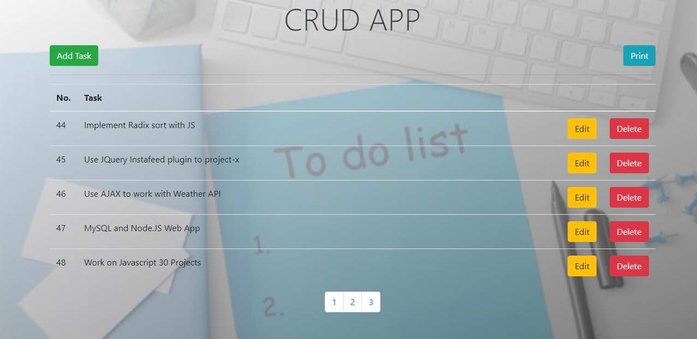

# CRUD-operation
Implemented a Task Manager app (CRUD operation) with PHP and MySQL Database.
For Web Developers It is very important to know the CRUD Operation i.e. Insert, Update, Delete operations. These DB manipulation technique helps to create User Registration and so many things. This app was made to practice the CRUD and succesfully finished. :) 
Watch the link in the description above.

